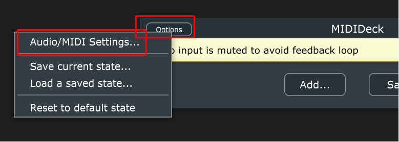
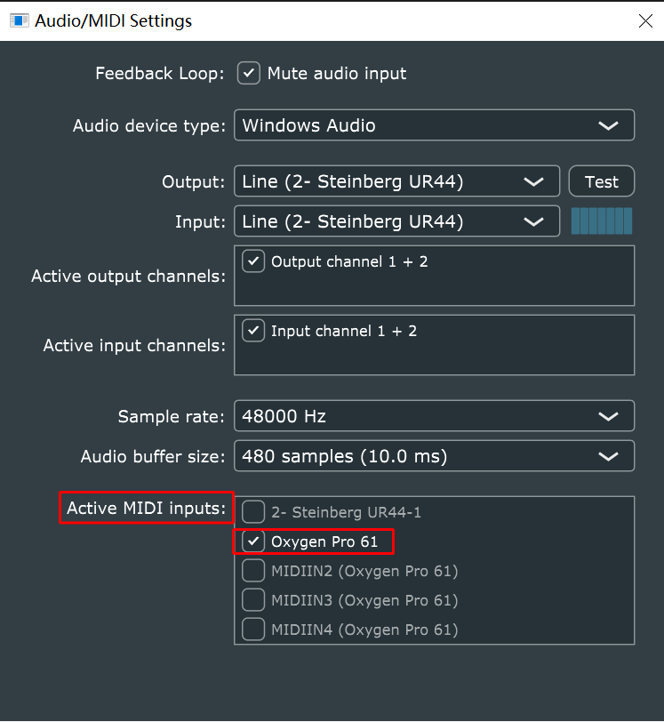
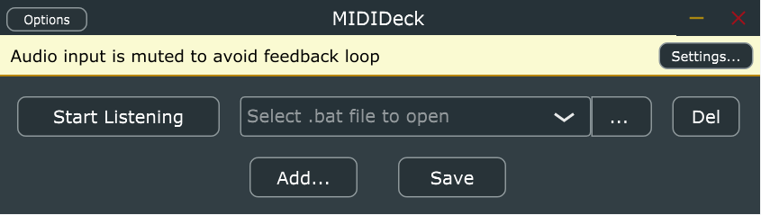

# MIDIDeck

Use your midi keyboard as a stream deck

# How to build

1. You need to configure the JUCE environment. You can get JUCE at this link: [Download - JUCE](https://juce.com/download/)

2. If you are very confused about the first step, I also have an introductory tutorial for JUCE that you can refer to: https://www.bilibili.com/video/BV14Q4y1c79d

3. Of course, you can also download the latest compiled .exe file directly from the Release page.

# How to use

Make sure you have selected your MIDI keyboard in *Audio/MIDI Settings*.

Then press the Add button and you can see that a Start Listening button and a file selector will be created.

Press the Start Listening button, then press the key on the MIDI keyboard you want to map to. The entered MIDI note will be recognized.

Finally, select the .bat file you want to execute.

Enjoy your MIDI mapping shortcuts!!~~

# Todo

1. Support for Mac

2. Better looking interface
